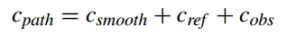
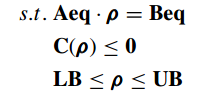
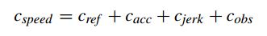
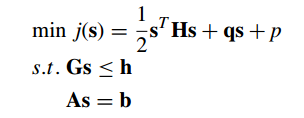
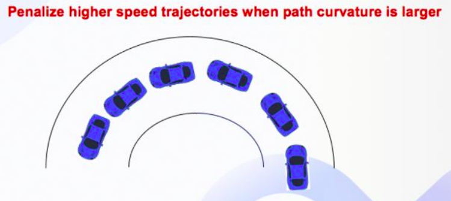

# Robot-Planning-and-Control


# 强化学习基础


## 2019-Mastering Atari, Go, Chess and Shogi by Planning with a Learned Model
相关视频：

- https://www.youtube.com/watch?v=vt5jOSy7cz8

- https://www.youtube.com/watch?v=hYV4-m7_SK8

- https://www.youtube.com/watch?v=We20YSAJZSE

MuZero是一种基于模型的强化学习算法。这是DeepMind研究人员设想的一系列强化学习算法中最新的算法。从2014年开始，随着著名的AlphaGo的诞生。阿尔法围棋在2015年击败了围棋冠军李塞多。

AlphaGo使用一个称为蒙特卡罗树搜索（MCTS）的旧原则来计划游戏的其余部分作为决策树。但其精妙之处在于增加了一个神经网络来智能地选择移动，从而减少了未来要模拟的移动次数。

AlphaGo的神经网络从人类玩游戏的历史开始训练，在2017年AlphaGo被不再使用这段历史的AlphaGo Zero取代。这是第一次，该算法在不知道围棋策略的情况下，学会了独自玩。它与自己对抗（与MCTS），然后从这些部分学习（神经网络的训练）。

AlphaZero是AlphaGo Zero的一个版本，我们删除了所有与围棋游戏相关的小技巧，以便将其推广到其他棋类游戏中。

2019年11月，DeepMind团队发布了一个新的、更通用的AlphaZero版本，名为MuZero。它的特殊性是基于模型的，这意味着算法对博弈有自己的理解。博弈规则是通过神经网络来学习的，MuZero建立了他自己对游戏的理解。他可以自己想象，如果一个人做这样或那样的动作，游戏会是什么样子，而在MuZero之前，一个动作对游戏的影响是硬编码的。MuZero可以像人一样玩任何游戏。

https://github.com/werner-duvaud/muzero-general/wiki/How-MuZero-works


摘要-构建具有规划能力的智能体一直是追求人工智能的主要挑战之一。基于树的规划方法在具有挑战性的领域取得了巨大的成功，例如象棋和围棋，在这些领域有一个完美的模拟器。然而，在现实问题中，控制环境的动力往往是复杂和未知的。在这项工作中，我们提出了MuZero算法，该算法通过将基于树的搜索与学习模型相结合，在一系列具有挑战性和视觉复杂性的领域中实现超人的性能，而不需要了解它们的底层动力学。MuZero学习了一个模型，当迭代应用时，它预测与计划最直接相关的数量：奖励、行动选择策略和价值函数。当在57个不同的Atari游戏上进行评估时，我们的新算法达到了一个新的水平，这是一个测试人工智能技术的标准视频游戏环境，在这个环境中，基于模型的规划方法一直在挣扎。在进行评估时，国际象棋和shogi在不了解游戏规则的情况下，MuZero与游戏规则提供的AlphaZero算法的超人性能相匹配。


### 2017-NIPS-Imagination-Augmented Agents for Deep Reinforcement Learning

相关视频：

- https://www.youtube.com/watch?v=xp-YOPcjkFw

- https://www.youtube.com/watch?v=agXIYMCICcc


#### 1 Introduction

在使用深度神经网络和**无模型强化学**习（RL）为许多领域开发有能力的代理方面取得了进展，其中原始观测直接映射到值或动作。然而，这种方法通常需要大量的训练数据，并且所得到的策略不容易推广到相同环境中的新任务，因为它缺乏一般智力的行为灵活性构成。

**基于模型的RL**旨在通过赋予代理一个由过去经验合成的世界模型来解决这些缺点。通过使用内部模型对未来进行推理（这里也称为想象），代理人可以寻求积极的结果，同时避免现实环境中反复试验的不利后果，包括做出不可逆转、糟糕的决定。即使该模型需要首先学习，它也可以更好地跨状态进行泛化，在同一环境中跨任务保持有效，并利用额外的无监督学习信号，从而最终提高数据效率。基于模型的方法的另一个吸引人之处是它们能够通过增加内部模拟的数量的更多计算来扩展性能。

**最近的成功主要来自无模型方法**。在这样的领域中，基于模型的代理采用标准规划方法的性能通常遭受由函数逼近引起的模型误差。这些错误在规划过程中会加剧，导致过于乐观或性能差。

**我们试图通过提出想象增强来解决这个缺点**，它通过“学习解释”其不完美的预测来使用近似的环境模型。我们的算法可以直接在低层的观测数据上训练，而不需要太多的领域知识，类似于最近的无模型成功。在不对环境模型的结构及其可能存在的缺陷作出任何假设的情况下，我们的方法以端到端的方式学习，从模型模拟中提取有用的知识，特别是不完全依赖模拟收益。这使得代理可以从基于模型的想象中获益，而不必像传统的基于模型的规划那样陷入陷阱。我们证明，在包括Sokoban在内的各个领域中，我们的方法比无模型基线执行得更好。即使在模型不完善的情况下，它也能以较少的数据获得更好的性能，这是实现基于模型的RL的重要一步。


#### 2 The I2A architecture


# 基于学习的决策


## 强化学习

### 2019-Predictive Trajectory Planning in Situations with Hidden Road Users Using Partially Observable Markov Decision Processes

摘要-近年来，仅基于传感器测量的最先进的紧急制动辅助系统大大减少了交通事故和人员伤亡。为了能够对因传感器限制或遮挡而避开车辆视野的道路使用者做出反应，提出了一种在自主车辆决策过程中预测遮挡区域潜在隐藏交通参与者的方法。采用**部分可观测的马尔可夫决策过程**来**确定车辆的纵向运动**。使用车辆的视野进行观察。因此，根据当前或预测的环境，使用传感器设置的通用模型计算视野。这样，车辆既可以观察到它检测到先前隐藏的道路使用者，也可以接收到道路畅通的信息。总的来说，这使得车辆能够更好地预测未来的发展。因此，需要对可能位于隐蔽区域的车辆进行假设。我们将在两个场景中演示该方法。首先在一个场景中，车辆必须以最少的动作谨慎地驶入交叉口，其次在城市交通的典型场景中。评价结果表明，该方法能够正确预测隐藏的道路使用者，并采取相应的措施。

- 这篇文章获得了**IV19 Best Paper Award**，可见POMDP在自动驾驶领域的潜力。
- 本文能够正确预测隐藏的道路使用者，相当于进行了风险评估，对车辆加减速进行控制。


提出了一种概率规划方法，能够在预期的规划过程中安全地处理上述情况。我们使用部分可观察马尔可夫决策过程（POMDP）来解决潜在道路使用者的挑战。在规划过程中，自主车辆能够根据当前和预测的环境考虑未来的观测。为了确定车辆将看到什么，我们使用车辆传感器设置的通用表示来计算其视野。总的来说，视野和对隐藏车辆的假设的结合导致了一个更具前瞻性和前瞻性的规划过程。


## Learning Driver Behavior Models from Traffic Observations for Decision Making and Planning

摘要：对于复杂的驾驶员辅助系统和自动驾驶来说，随着时间的推移估计和预测交通状况是必不可少的能力。当需要更长的预测范围时，例如在决策或运动规划中，在不牺牲稳健性和安全性的前提下，不完全环境感知和随时间的随机情况发展所引起的不确定性是不可忽略的。**建立驾驶员与环境、道路网络和其他交通参与者相互作用的一致概率模型**是一个复杂的问题。本文通过建立描述驾驶员行为和计划的层次动态贝叶斯模型，对驾驶员的决策过程进行建模。这样，所有抽象级别的过程中的不确定性都可以用数学上一致的方式处理。由于驾驶员行为难以建模，我们提出了一种学习交通参与者行为的连续、非线性、上下文相关模型的方法。我们提出了一个期望最大化（EM）的方法来学习集成在DBN的模型从未标记的观测。实验表明，与只考虑车辆动力学的标准模型相比，该模型在估计和预测精度上有了显著提高。最后，提出了一种新的自主驾驶策略决策方法。它是基于一个连续的部分可观测马尔可夫决策过程（POMDP），使用该模型进行预测。


# 基于规则的决策


## 2018-Reachability-based Decision Making for City Driving

针对具有高级驾驶辅助和自动化特征的车辆，设计了一种离散决策算法。我们将系统建模为一个混合自动机，其中自动机中离散模式之间的转换对应于驱动模式决策，并开发了一种基于前后可达集的模式转换时间确定方法。该算法既可以作为一个独立的组件，也可以作为一种方法来指导底层的运动规划器获得安全的参考轨迹。在一定的假设条件下，该算法保证了城市交通的安全性和生动性，并通过计算机仿真验证了算法的有效性。


视频参考：https://www.youtube.com/watch?v=uLOsCZ4s03U


## 2019-Trajectory Optimization and Situational Analysis Framework for Autonomous Overtaking with Visibility Maximization

### IV. BEHAVIORAL PLANNER


- F: Follow ego-lane  沿车道行驶，需要约束路径偏离
- V: Visibility Maximization　最大化视野范围，需要放宽路径偏离约束
- O: Overtake　超车，需要计算超车路径
- M: Merge back　切换回原先的车道，需要计算换道路径
- W: Wait:　减速直至停止，观测环境变化


σ1 : Obstacle to be overtaken in ego lane detected.
σ2 : Visibility and overtaking time is sufficient / no feasible ego lane trajectory.
σ3 : Complete occlusion.
σ4 : Overtaking maneuver is completed.
σ5 : Incoming traffic in opposite lane detected and overtaking time is insufficient.
σ6 : Incoming traffic is cleared, and sufficiency criteria not yet fulfilled.
σ7 : Incoming traffic in opposite lane detected and overtaking time is insufficient.
σ8 : Incoming traffic is cleared, and sufficiency criteria are fulfilled.
σ9 : Incoming traffic in opposite lane detected and overtaking time is insufficient.
σ10 : Incoming traffic is cleared, and overtaking maneuver is completed or canceled.
σ11 : Merging maneuver is completed.

### V. TRAJECTORY GENERATION

#### A. Vehicle Model

#### B. Path Representation and Tracking

#### C. Road Boundaries


#### D. Obstacle Representation


#### E. Visibility Maximization

以“视野角”的大小表示感知情况，评估风险，并作为目标函数进行优化


#### F. MPC Formulation


### VI. SITUATIONAL ANALYSIS FRAMEWORK

#### A. Occupancy of Other Traffic Participants


超车的最佳时间为$t_{overtake}$


#### B. Information Sufficiency


信息充分性：如果车辆在sufficiency line之前，信息是充分的，视野良好；反之，视野受限，风险增加。

$S_{sufficient}$的值决定了行为的激进/保守程度，这里选取$S_{sufficient}$为一个车长的距离(4m)。


#### C. Overtaking Maneuver Risk Assessment


TODO：

查看文献27：dynamic virtual bumper


超车需要规划出一条超车参考路线，需要综合考虑车辆运动学和动力学约束。


### VII. SIMULATION RESULTS


## 2014-A Behavioral Planning Framework for Autonomous Driving.pdf


#　轨迹预测

标题：Trajectron++: Multi-Agent Generative Trajectory Forecasting With Heterogeneous Data for Control.pdf

作者：Tim Salzmann　 Boris Ivanovic　Punarjay Chakravarty　Marco Pavone

团队：Autonomous Systems Lab, Stanford University 　　Ford Greenfield Labs

摘要：对人类在环境中的运动进行推理是实现安全的、具有社会意识的机器人导航的重要前提。因此，多智能体行为预测已经成为自动驾驶汽车等现代人机交互系统的核心组成部分。虽然存在多种用于轨迹预测的方法，但它们中的许多仅用一种语义类的智能体进行评估，并且仅使用先前的轨迹信息，忽略了从通用传感器到自治系统的在线可用的大量信息。为此，我们提出了Trajectron++，这是一个模块化的、图结构的递归模型，它可以在包含异构数据（如语义图和相机图像）的同时，预测具有不同语义类的一般智能体的轨迹。我们的模型与机器人规划和控制框架紧密结合，能够生成对主体运动规划产生重要影响的预测。我们在几个具有挑战性的现实世界轨迹预测数据集上演示了我们的模型的性能，其性能超过了一系列最先进的确定性和生成性方法。


# 基于学习的运动规划

## 深度学习


## 强化学习

### 2020-Survey of Deep Reinforcement Learning for Motion Planning of Autonomous Vehicles

**摘要：**近年来，自主汽车领域的学术研究在传感器技术、V2X通信、安全、安保、决策、控制，甚至法律和标准化规则等方面都得到了广泛的应用。除了经典的控制设计方法外，人工智能和机器学习方法几乎在所有这些领域都有应用。研究的另一部分集中在运动规划的不同层次，如战略决策、轨迹规划和控制。机器学习本身已经发展出一系列的技术，本文描述了其中一个领域，深度强化学习（DRL）。本文对分层运动规划问题进行了深入的研究，并介绍了DRL的基本原理。设计这样一个系统的主要要素是环境的建模、建模抽象、状态和感知模型的描述、适当的奖励和底层神经网络的实现。本文介绍了车辆模型、仿真可能性和计算要求。给出了不同层次和观测模型的战略决策，如连续和离散状态表示、基于网格和基于摄像机的解决方案。本文综述了由自动驾驶的不同任务和层次（如跟车、车道保持、轨迹跟踪、合并或在密集交通中驾驶）系统化的最新解决方案。最后，讨论了开放性问题和未来的挑战。

**标签：**综述性文章  深度强化学习


#### I. INTRODUCTION

**A. The Hierarchical Classification of Motion Planning for Autonomous Driving**

自动驾驶车辆运动规划的层次结构：路线规划、行为规划、运动规划、反馈控制


**B. Reinforcement Learning**


# 基于人工势场的运动规划


# 基于采样的运动规划

## A*及其变种

参考简介：https://www.jianshu.com/p/a3951ce7574d

https://www.cnblogs.com/Leonhard-/p/6866070.html

https://www.cnblogs.com/yangrouchuan/p/6373285.html

https://blog.csdn.net/lqzdreamer/article/details/85108310


A* :

Weighted A*:

ARA\*: anytime repairing A\*

LPA*：Lifelong Planning A\*

D\*:D\*是动态A\*（[D-Star](https://baike.baidu.com/item/D-Star), Dynamic A*）

D* Lite:

Focussed D*:

Field D*:

Theta\*:算法可以优化A\*​的路径，但是如果A*算法部分做的不够好的话，theta\*效果会大打折扣。

LazyTheta*:


## Lattice


### 2015-State Lattice-based Motion Planning for Autonomous On-Road Driving


在DUC比赛中，BOSS作为代表性的自动驾驶车辆。它的运动规划采用了lattice-based planner，在结构化的道路上进行规划。

这之后，基于BOSS，有很多改进的算法相继诞生。

- spatiotemporal state lattice

基于Boss，[23]和[38]说明了使用时空状态格的运动规划策略。这次，我们对几列姿势进行了采样，而不是只对[14]中描述的一列进行采样。曲率也作为姿态元素添加。来自不同列的满足特定连接模式的两个姿势将被连接以呈现路径边。路径边的计算仍然采用曲率多项式，虽然它是由以前的二次多项式更新为三次多项式的，这种自适应是为了保证姿态处的曲率连续性，而姿态可以作为积分轨迹的切换点。然后在螺旋路径边上应用一定数量的速度剖面来绘制轨迹边。除了[14]中先前应用的恒定和线性速度剖面外，还考虑了由比例导数（PD）定律控制的车辆跟随特性的加速度剖面。


- 在[25]中提出了一种变种的lattice planner，它通过较少密集地采样，但后优化得到的轨迹来实现降低计算复杂度。

  


[23]中用于从ego载体到状态格的轨迹段的曲率三次螺旋被曲率四次螺旋所代替。这就减少了两个连续平面交叉处曲率变化率方面的突出跳跃，从而提高了平面的一致性。与文献[23]中描述的动态构造的分辨率等效状态格不同，[25]中使用的图通过引入预定的离散速度空间来体现对时间空间的考虑。因此，通过在路径边上应用三次速度多项式生成轨迹边。

速度多项式的系数可以在给定固定速度和边缘两个端点处零加速度的假设下确定。这样就保证了轨迹切换点的加速度连续性，使得轨迹与文献[23]相比具有更好的平滑性。然而，速度单元的数量实际上是有限的，这意味着不同的轨迹轮廓更少。最后，通过约束的横向偏移，曲率，航向，速度和加速度所施加的固定的图形顶点形成最后的优化轨迹。据测试，在换道、静态障碍物和动态障碍物三种实验场景下，合成轨迹的性能提高了10%，计算时间缩短了50%以上。

- [26]和[27]指出，上述时空采样和搜索方法通过构造和评估最终将被丢弃的rajectors而浪费了大量计算时间。他们建议，集中注意力时间采样、搜索应进行的地区，这些区域最佳轨迹存在的可能性很高。

在[27][26]中，提出了一种两步规划方法。第一步的目标是获得一个参考轨迹，包括一个非参数播种路径和一个可沿该路径应用的可调节速度剖面。在具体实现中，首先对感兴趣的空间进行搜索和定位，不考虑时间空间。这意味着一种启发式方法，静态成本单独决定聚焦的空间区域。因此，有时这种运动规划方法可能无法得到满意的解，例如，当时间相关成本而不是静态成本确定聚焦空间采样空间时。在第二步中，聚焦采样在由调节的速度剖面指定的时空区域内进行，并稍微偏移种子路径。现阶段的弹道结构与文献[25]相似。这种运动规划方法被认为是实用和有效的。

- 继承了[24]所示的采样方法，[39]和[17]提出了一种基于终端流形的运动规划器。

  终端流形可以看作是由通过[24]的采样方法得到的采样顶点组成的。它被称为终端流形，因为所有的轨迹从ego车辆开始，并在采样顶点结束。由于没有构造图，因此不需要昂贵的基于图的搜索，因此避免了昂贵的计算麻烦的问题[24]。在轨迹表示方面，高速驾驶采用文献[24]中提出的方法，而低速驾驶的横向运动则取决于纵向运动。这种待遇被认为是合理的。一方面，由于引入潜在侧滑，车辆相对于道路中心线的纵向和横向运动在高速时高度解耦，这有利于轨道纵向和横向方面的解耦设计。另一方面，在低速时无侧滑是一个有效的假设，因此非完整约束起着关键作用，如果采用解耦设计，由于无效的曲率，将使大多数轨迹失效。仿真结果表明，合成的运动规划器能够很好地处理城市交通和公路交通中的几种具有挑战性的交通场景。


> 注：
>
> [23] Matthew McNaughton. Parallel algorithms for real-time motion planning. 2011.
>
> [25] Wenda Xu, Junqing Wei, John M Dolan, Huijing Zhao, and Hongbin Zha. A
> real-time motion planner with trajectory optimization for autonomous vehicles. In
> Robotics and Automation (ICRA), 2012 IEEE International Conference on, pages
> 2061{2067. IEEE, 2012.
>
> [38] Matthew McNaughton, Chris Urmson, John M Dolan, and Jin-Woo Lee. Motion planning for autonomous driving with a conformal spatiotemporal lattice. In
> Robotics and Automation (ICRA), 2011 IEEE International Conference on, pages
> 4889{4895. IEEE, 2011.


### 2015-Real-time motion planning methods for autonomous on-road driving: State-of-the-art and future research directions

综述文章


### 2014-Trajectory Planning for BERTHA -a Local, Continuous Method

摘要：本文在总结前人研究成果的基础上，提出了在完全自主完成柏莎-奔驰纪念路线103公里的车辆上进行轨迹规划的策略。我们提出一个由变分公式导出的局部连续方法。解的轨迹是一个目标函数的约束极值，该目标函数用于表达动态可行性和舒适性。静态和动态障碍物约束以多边形的形式合并。这些约束经过精心设计，以确保解收敛到单个全局最优解。

#### II. RELATED WORK

**A. Preliminaries**

**B. Objective function**

代价函数组成：


**C. Constraint functions**

约束项：内部约束、外部约束

内部约束：最大曲率、最大加速度等

外部约束：物体碰撞


进行物体碰撞检测，自车用多个圆表示，障碍物用多边形表示。


**D. Building constraint polygons from sensor data**


静态障碍物：left-right decision 根据简单的几何结构，将障碍物分配到左右两边


动态障碍物：分为迎面车辆，划分在右侧；超车车辆，划分在左侧

移动障碍物预测：常速并且与右边界保持固定的距离。


**E. Distance function**

//TODO

基于优化的路径选择


**F. Re-planning scheme**


**G. Constrained optimization**

//TODO


### 2013-IV-Focused Trajectory Planning for Autonomous On-Road Driving

论文解析：https://blog.csdn.net/gophae/article/details/104069222

本文所论述的方法仅适用于静态障碍物避障，且不考虑碰撞检测成功性，属于简单不可行的方法，但具有一定参考意义。


摘要—自动驾驶汽车的道路运动规划通常是一个具有挑战性的问题。 过去的努力已经针对城市和高速公路环境分别提出了解决方案。 我们确定了现有解决方案的主要优点/缺点，并提出了一种新颖的两步运动计划系统，该系统可在一个框架内解决城市和高速公路驾驶问题。 参考轨迹规划（I）利用密集的晶格采样和优化技术来生成易于调整且类似于人的参考轨迹，以解决道路几何形状，障碍物和高级指令的问题。 通过围绕参考轨迹进行集中采样，跟踪轨迹计划（II）生成，评估和选择进一步满足运动动力学约束以执行的参数轨迹。 所描述的方法保留了详尽的时空规划器的大多数性能优势，同时显着减少了计算量。

本方法的结构是这样的：


核心结构上由两个planner组成，第一个是为了减少计算量所设计的‘’粗糙‘’planner, 计算出一点直线段构成的0阶连续曲线，然后拟合成三阶多项式（曲率连续）。第二个planner 再上一个planner的基础上对曲线进行进一步优化，使曲率更加平滑，同时保证横向偏差尽量小。

第一个planner:


接下来就是进行第二次优化，下图表示了第二次优化和第一次的粗糙曲线的关系：


具体解析参考：https://blog.csdn.net/gophae/article/details/104069222


### 2012-IJRR-Optimal trajectories for time-critical street scenarios using discretized terminal manifolds

视频：https://www.youtube.com/watch?v=se2aRN_UBZM

论文解析：https://zhuanlan.zhihu.com/p/51097792

用最优化方法没有考虑各种限制因素，规划处的路径可能更为偏激。


研究了移动交通中自主车辆所面临的轨迹生成问题。在给定交通流的预测运动的情况下，提出的半反应式规划策略实现了所有需要的长期机动任务（换道、合并、保持距离、保持速度、精确停车等），同时提供了短期的避碰。在街道相对坐标系中，采用精心选择的成本函数和终端状态集（流形）对横向和纵向运动进行组合优化，是获得舒适、人性化和物理上可行的轨迹的关键。仿真交通场景验证了该方法的性能。


### 1. Introduction


上述方法如果进行长久的重新规划，那么如果我们引入启发式或次优性，就会产生关键的影响。连续规划之间的差异很容易导致车辆运动的超调，振荡甚至不稳定，这在高速行驶时尤为重要。 此外，如图2所示，计划周期显着影响紧急轨迹。


但是，正如我们所提到的，**时间一致性（TC）**不能在实践中始终实现。 一方面，关于未来障碍物轨迹的先前假设可能被证明是错误的，因此必须根据新的传感器数据进行航向校正。 另一方面，计算时间以及优化范围是有限的，因此在每个步骤中都将包含新信息。对于本文中提出的策略，只有在没有实际阻碍TC的情况下，才能确保TC。

根据Bellman的“最优性原则”，**最优策略意味着TC**（Bellman 1954）。 这个事实，而不是特定的目标函数，是即将推出的最佳控制方法的原因。

而我们的方法是TC的。


### 2. Problem formulation in the Frenet coordinates

### 3. Optimal control formulation

### 4. Application to the original problem


### 2012-ICRA-A Real-Time Motion Planner with Trajectory Optimization for Autonomous Vehicles

摘要-本文提出了一种基于轨迹优化的实时自主驾驶运动规划器。规划人员首先对规划空间进行离散化，并基于一组成本函数搜索最优轨迹。然后对合成轨迹的轨迹和速度进行迭代优化。优化后的计算复杂度低，能够在几次迭代中收敛到更高质量的解。与未经优化的规划器相比，该框架可以减少52%的规划时间，提高轨迹质量。提出的运动规划器在三种不同的场景下分别在仿真和实车上进行了实现和测试。实验表明，该规划器能输出高质量的轨迹，并具有智能驾驶行为。


### 2011-Motion Planning for Autonomous Driving with a Conformal Spatiotemporal Lattice
摘要-我们提出了一种适用于公路自主驾驶的运动规划器，它采用了为行星漫游者导航而开创的状态格框架，以适应公共道路的结构化环境。本文的主要贡献在于提出了一种搜索空间表示方法，使得搜索算法能够系统有效地实时地探索时空维度。这使得低级planner，在有其他车辆在场的情况下，能够致力于规划跟随领先车辆、改变车道和绕过障碍物。我们证明了我们的算法可以很容易地在**GPU上加速**，并在自主乘用车上进行了演示。


#### I. INTRODUCTION

我们的计划者还使用了一种**新的时空搜索图**，它结合了沿选定空间维度的精确约束满足和沿时间维度的状态的分辨率等价剪枝，其结果是，在不过度增加状态空间大小的情况下，可以检查时间和速度的大量变化。

构建一个能够在复杂环境中智能操作的规划师的典型工作依赖于将规划解决方案分解为一个规划师层次结构，这些规划师依次对搜索空间进行更具体的表示，并在时间上进行更精细的离散化。层次结构中的每个计划者必须具有其他计划者的模型。这些模型必然有缺陷，否则分解将是多余的。规划者之间对行为的期望不匹配会导致计划动作的不稳定，特别是当上级规划者向下级规划者发出的命令不可行时。我们提出的规划框架通过在较低的层次上承担更多的责任来缓解这个问题，这些责任可以在尝试执行行动之前决定行动是否可行。

例如，通过在**统一优化框架内进行规划**，我们的规划者能够在没有特定行为指示的情况下，决定是保持在慢行交通后面的距离，还是改变车道以通过慢行交通。


#### II. RELATED WORK


#### III. METHOD


**A. Paths and Trajectories**

**B. Spatiotemporal Lattice**

每个顶点的状态向量表示为 $(x,y,a,θ,κ,[ti, ti+1),[vj, vj+1))$。在Frenet坐标系中，可简化表示为五维向量$(s,l,a,[ti, ti+1),[vj, vj+1))$。


搜索算法：


**C. Why include acceleration in the state space?**


从相同顶点出发的轨迹末端状态可能落在相同的时间速度晶格上，使用加速度维度区分轨迹。最终的轨迹拥有更一致的加速度剖面。

**D. Cost function**

代价函数分成两部分：

由于多个轨迹使用相同的基本路径，因此在使用该路径的各种轨迹之前，仅依赖于$（x，y，θ，k）$的代价函数项被计算。然后根据每条轨迹计算$a，t，v$的项。


**E. Picking the best final state**

代价函数：最小化轨迹成本的加权总和上+进一步行驶的奖励+花费额外时间的惩罚。


然后，从$n_f$到起始状态反向追溯，重构最优轨迹。


**F. World Representation**

静态障碍物的表示：通过离散化的$(x,y)$空间，将静态障碍物放到查找表中。

动态障碍物的表示：离散化三维$(x,y,t)$空间，将移动障碍物放入表格中。

障碍物用矩形框表示，在每次采样时执行一次查表操作。


#### IV. GPU ACCELERATION

GPU可以用来加速算法。当最坏的搜索情况发生时，不可避免要遍历整个图。所以我们必须搜索整个图。


#### V. EXPERIMENTAL RESULTS

分别在CPU和GPU上测试了完整的规划所需时间，如下表所示。


该planner展示了良好的轨迹规划特性，例如过弯道时，能够规划出合理的速度和加速度。在换道、超车、并线等一系列决策中也表现良好。


### 2009-Differentially Constrained Mobile Robot Motion Planning in State Lattices


lattice起源文章？


# 基于优化的运动规划


## 2019-ITSC-Optimal Trajectory Generation for Autonomous Vehicles Under Centripetal Acceleration Constraints for In-lane Driving Scenarios

文章解析：https://www.cnblogs.com/liuzubing/p/11051390.html


## 2019-A Decoupled Trajectory Planning Framework Based on the Integration of Lattice Searching and Convex Optimization

这篇文章总结和对比了前人在轨迹规划（维度包含$x,y,theta,v$）所采用的方法，作者采取了一种解耦方法，进行了上述维度的规划。本文思路与EM_planner DP/QP优化过程基本一致，并在曲率的连续性上做出了一些改进。文章细节交代比较清楚，方便工程实现。

摘要：本文提出了一种基于格搜索和凸优化集成的解耦轨迹规划框架，用于结构化环境中的自动驾驶。对于带有时间戳信息的3D轨迹规划问题，由于存在多种约束，其可行域是非凸的，因此很容易陷入局部最优的轨迹规划,并且该问题的解空间非常大，以至于很难在多项式时间内确定最优解。为了解决该非凸问题，并提高优化过程的收敛速度，考虑到离散化驾驶环境并减少求解空间的能力，采用了基于点阵搜索的方法。由晶格搜索产生的最终路径通常位于全局最优值的附近。但是，该解决方案既不是时空平滑的，也不是全局最优的，因此通常称为粗糙解。因此，引入了随后的非线性优化过程以细化粗略轨迹（由路径和速度组合）。本文提出的框架是通过在各种挑战性场景中进行仿真来实现和评估的。仿真结果验证了轨迹规划器可以生成高质量的轨迹，并且执行时间也是可以接受的。


### III. METHODOLOGY


**A. PATH SEARCHING**

在$s-\rho $坐标系中采样。


Cost分为三部分：平滑、距离参考线距离、动静态障碍物的碰撞风险



传统的碰撞检测方法是计算所有路径与每个障碍物的距离，计算量复杂度是$O(NM)$。这里碰撞风险的计算使用了一种高斯卷积方法，显著降低了计算量[26]。


想法：碰撞检测的实现可以在$s-l$坐标系下，使用查表方式实现。假设所有的障碍物均表示在$s-\rho$坐标系下，根据障碍物的s范围，查询每条轨迹对应的s段轨迹点集wps，并计算每个wp是否在障碍物内。碰撞风险可以用上述的卷积代替距离计算。


每段轨迹的cost计算完之后，接下来是采用一种遍历手段，找出cost最小的路径。本文采用Dijkstra方法进行遍历。与Dijkstra算法不同的是，没有事先指定目标点，而是设计了目标点队列，存放多个目标点。当列表中的端点全部展开时，选择代价最小的作为我们的短期目标位置。**目标点队列？**


**B. PATH OPTIMIZATION**

优化代价函数：


约束：

- 内在约束：最大曲率
- 外在约束：不超过道路边界、无碰撞、道路速度限制



注意：所有的计算均是在$s-\rho$坐标系中进行，包括碰撞检测，这需要将障碍物表示在$s-\rho$坐标系中。轨迹优化时碰撞检测包含了所有障碍物（动静障碍），计算每个轨迹点的时刻与障碍物对应时刻在位置上是否相交。

轨迹优化使用的是开源非线性优化工具CasADi。


**C. SPEED PROFILE SEARCHING**


代价函数：包含与参考速度的差异、加速度大小、加加速度大小、与障碍物碰撞风险



碰撞风险可以使用TTC（Time-To-Collision）、DTC（Distance-To-Collision ）、TTR（Time-ToReact）等表示。本文选择了DTC方案。这里的碰撞检测只根据ST图计算了纵向？


同路径的遍历基本一致，也使用了Dijkstra算法进行速度曲线寻优。


注意：速度轨迹搜索仅考虑动态障碍物（在S-T图中的障碍物均为动态障碍物），因为在上一步路径的选择、优化过程中，已经规避了动静态障碍物，但是动态障碍物的碰撞时间会随着车辆速度的变化产生变化，而静态障碍物不会。所以仅需考虑动态障碍物即可。


**D. SPEED PROFILE OPTIMIZATION**

优化：




碰撞约束：只考虑纵向s方向的碰撞？


###　IV. CASE STUDIES

轨迹优化使用的是开源非线性优化工具CasADi

优化解算器使用开源库IPOPT

速度优化和MPC使用开源优化库CVXOPT、CVXPY


想法：当检测存在噪声时，应急情况的处理：

- 当速度检测出现问题：后面有一辆车，速度极大，导致planner无法规划路径，车辆是否应该急停？
- 当障碍物检测出现问题或者突发的静态障碍物出现：道路突发情况，无法规划路径，急停？


## 2018-Baidu Apollo EM Motion Planner

摘要-本文介绍了一个基于百度阿波罗（开源）自主驾驶平台的实时运动规划系统。开发的系统旨在解决工业4级运动规划问题，同时考虑安全性、舒适性和可扩展性。该系统以分层的方式覆盖多车道和单车道的自主驾驶：（1）系统顶层是一种多车道策略，通过比较并行计算的车道水平轨迹来处理车道变换情况。（2） 在车道级轨迹生成器中，基于Frenet框架迭代求解路径和速度优化问题。（3） 针对路径和速度优化问题，提出了动态规划和基于样条函数的二次规划相结合的方法，构造了一个可扩展且易于调整的框架，同时处理交通规则、障碍物决策和平滑度。该规划方法可扩展到高速公路和低速城市驾驶场景。我们还通过场景说明和道路测试结果演示了该算法。

### I. INTRODUCTION

**A. Multilane Strategy**


**B. Path-Speed Iterative Algorithm**


**C. Decisions and Traffic Regulations**

针对4级自主驾驶，决策模块应包括可扩展性和可行性。可伸缩性是场景表达能力（即可以解释的自主驾驶案例）。当考虑几十个障碍物时，决策行为很难用有限的自我汽车状态集来精确描述。对于可行性，我们的意思是，生成的决策应包括一个可行区域，在该可行区域内，ego车可以在动态限制内进行机动。然而，手动调整和基于模型的决策都不能生成无碰撞轨迹来验证其可行性。

在EM-planner的决策步骤中，我们以不同的方式描述行为。首先，用一个粗糙可行的轨迹来描述汽车的自我运动意图。然后，用此轨迹测量障碍物之间的相互作用。即使场景变得更加复杂，这种基于轨迹的可行决策也是可伸缩的。其次，规划器还将根据轨迹生成一个凸可行空间来平滑样条曲线参数。基于二次规划的平滑样条曲线解算器可以用来生成更平滑的路径和速度剖面。这保证了一个可行和顺利的解决方案。


### II. EM PLANNER FRAMEWORK WITH MULTILANE STRATEGY


### III. EM PLANNER AT LANE LEVEL


在第一个E-step，会将动静态障碍物投影到Frenet坐标系下，并且只考虑低速车辆和到来的障碍物，对于高速物体，EM Planner基于安全原因更倾向于变道。在第二个E-step，会考虑高速、低速车辆以及到来的障碍物。

两个M-step，首先使用DP在非凸的空间中生成粗糙的解，接下来使用QP进行凸优化求出平滑的解。


**A. SL and ST Mapping (E-step)**


SL映射


ST映射


**B. M-Step DP Path**


晶格采样是基于Frenet框架的。如图7所示，首先在ego车辆之前对多行点进行采样。不同行之间的点用五次多项式边光滑连接。点行之间的间隔距离取决于速度、道路结构、车道变换等。该框架允许根据应用程序场景自定义采样策略。例如，换道可能需要比当前车道行驶更长的采样间隔。此外，出于安全考虑，采样距离将至少覆盖8秒或200米。

在lattice轨迹构造之后，通过代价函数的求和来评价图的每一条边。我们使用SL投影、交通规则和车辆动力学的信息来构建函数。总边缘成本函数是平滑度、避障和车道成本函数的线性组合。

这里Cost有三个组成部分：平滑Cost、离障碍物距离Cost、离偏导线偏差Cost


其中，


Nudge Decision包括nudge，yield和overtake，用来生成convex hull来进行QP的spline优化。


**C. M-Step Spline QP Path**


QP的Cost相对简单些，就是负责平滑的路径一阶二阶三阶倒数还有DP结果与引导线的偏差。

**D. M-Step DP Speed Optimizer**


**E. M-Step QP Speed Optimizer**


**G. Notes on Non-convex Optimization With DP and QP**


### IV. CASE STUDY


参考：

[1] https://blog.csdn.net/yuxuan20062007/article/details/83629595


## Optimization-Based Collision Avoidance

摘要：利用凸优化的强对偶性，提出了一种将不可微碰撞避免约束转化为光滑非线性约束的新方法。我们关注的是一个控制对象，其目标是在n维空间中移动时避开障碍物。所提出的重构不引入近似，并且适用于一般的障碍物和受控对象，它们可以表示为凸集的并集。我们将我们的结果与符号距离的概念联系起来，符号距离在传统的轨迹生成算法中得到了广泛的应用。我们的方法可以应用于一般的导航和轨迹规划任务，并且平滑特性允许使用通用的基于梯度和Hessian的优化算法。最后，在无法避免碰撞的情况下，我们的框架允许我们找到“至少有吸引力”的轨迹，以穿透力来衡量。我们证明了我们的框架在四直升机导航和自动泊车问题上的有效性，并且我们的数值实验表明，所提出的方法能够在紧环境下实现基于实时优化的轨迹规划问题。我们实现的源代码见https://github.com/XiaojingGeorgeZhang/OBCA。

## 

## Integrated Online Trajectory Planning and Optimization in Distinctive Topologies

这篇文章**最为**详细地说明了TEB实现。

参考：

[1] http://www.pianshen.com/article/4783688865/

## Elastic Bands: Connecting Path Planning and Control

弹性带（EB）起源文章


## Kinodynamic Trajectory Optimization and Control for Car-Like Robots

这篇文章介绍**较为**详细地说明了TEB实现。


## Efficient Trajectory Optimization using a Sparse Model

**时间弹性带算法使用g2o框架求解**

摘要-“时间弹性带(TEB)”方法通过随后修改由全局规划器生成的初始轨迹来优化机器人轨迹。轨迹优化所考虑的目标包括但不限于总路径长度、轨迹执行时间、与障碍物的分离、通过中间路径点以及满足机器人的动力学、运动学和几何约束。TEB明确地考虑了运动的时空方面的动态约束，如有限的机器人速度和加速度。轨迹规划实时运行，使得TEB能够应对动态障碍物和运动约束。将“TEB问题”描述为一个尺度化的多目标优化问题。大多数目标是局部的，只与一小部分参数有关，因为它们只依赖于几个连续的机器人状态。这种局部结构产生一个稀疏的系统矩阵，从而允许使用快速有效的优化技术，如开源框架“g2o”来解决TEB问题。g2o稀疏系统解算器已成功地应用于VSLAM问题。本文描述了g2o框架在TEB轨迹修正中的应用和适应性。仿真和实际机器人实验结果表明，该方法具有良好的鲁棒性和计算效率。


### II. TIMED ELASTIC BAND

#### A. Definition of Timed Elastic Band (TEB)


#### B. Problem representation as a Hyper-Graph


#### C. Control flow


## G2o: A general framework for graph optimization

摘要-机器人学和计算机视觉中的许多常见问题，包括各种类型的同时定位和映射（SLAM）或束平差（BA），可以**用图形表示的误差函数的最小二乘优化来表达**。本文描述了这些问题的一般结构，并提出了**G2O，一个开源的C++框架**，用于**优化基于图的非线性误差函数**。我们的系统被设计成很容易扩展到各种各样的问题，一个新的问题通常可以在几行代码中指定。当前的实现为SLAM和BA的几种变体提供了解决方案。我们提供了对大量真实世界和模拟数据集的评估。结果表明，虽然g2o是通用的，但它的性能可以与针对特定问题的现有方法的实现相媲美。


g2o的本质：g2o是一个算法集的C++实现，而并不是在算法理论上的创新，即根据前人求解非线性最小二乘的理论，根据具体的问题，选用最合适的算法。

它是一个平台，你可以加入你自己的线性方程求解器，编写自己的优化目标函数，确定更新的方式。g2o的作者说Guassian-Newton和Levenberg-Marquardt方法比较naive，但是g2o的本质就是这些算法的实现。事实上，g2o iSAM SPA和 sSPA等非线性优化算法只是在非线性问题线性化时处理得不一样，在线性化后要求解线性方程都是利用了已有的linear solver库来求解，如 CSparse CHOLMOD PCG等，他们都需要依靠Eigen这个线性代数库。

g2o的用途：很多机器人的应用如SLAM（同步定位与制图）还有计算机视觉中的光束优化（bundle adjustment 都会涉及到最小化非线性误差函数的问题。这类应用中，**非线性误差函数可以用图(graph)的形式来表征**。整个问题的求解就是要找到最符合观测量的相机参数或机器人状态。

参考：

[1] https://blog.csdn.net/zhongjin616/article/details/15498779


# 组合运动规划（路线图）

　


# 路径跟踪


## Geometric Path Tracking Algorithm for Autonomous Driving in Pedestrian Environment

摘要：本文提出了一种用于自动驾驶的纯跟踪路径跟踪算法的替代公式。目前的方法有偷工减料的倾向，因此导致路径跟踪精度差。该方法**不仅考虑了被跟踪点的相对位置，而且还考虑了被跟踪点的路径方向**。根据车辆运动方程设计了转向控制律。该算法的有效性通过在无人驾驶的高尔夫球车上实现，并在步行环境下进行了测试。实验结果表明，新算法在不增加额外计算量的情况下，使同一给定预设路径的均方根（RMS）交叉跟踪误差降低46%，且**保持了原纯跟踪控制器的无抖振特性**。


改进了PPC算法： 减少过弯道时切角和超调，保持无抖振特性。

### III. PURE PURSUIT PATH TRACKING

#### B. Pure Pursuit Algorithm


图中，$Ｌ$为车辆轴距，$L_{fw}$为lookahead距离。$L_{fw}=kv(t)\in{[L_{min},L_{max}]}$


根据Fig. 4，三角形定理有：

$$\frac{L_{fw}}{sin(2\eta)}=\frac{R}{sin(\frac{\pi}{2}-\eta)}$$

$$\frac{L_{fw}}{２sin(\eta)cos(\eta)}=\frac{R}{cos(\eta)}$$

$$\frac{L_{fw}}{sin(\eta)}=2R$$

那么，曲率$\kappa=\frac{1}{R}=\frac{2sin(\eta)}{L_{fw}}$


（１）以$(v,\omega)$控制的底盘

很多移动机器人，较为代表的是差速轮底盘的移动机器人，车辆的控制指令通常为$(v,\omega)$，而$\omega=v(t)\kappa$

所以，计算出转角$\eta$，根据当前车辆速度$v(t)$，便可求出需要的角速度$\omega$，下发控制指令$(v,\omega)$即可。

（２）以$(v,\delta)$控制的底盘

较为代表的是乘用车为代表的阿卡曼模型和全驱动的双阿克曼模型，车辆控制指令为$(v,\delta)$


对于阿克曼模型

$$tan(\delta)=\frac{L}{R}$$

$$\delta=tan^{-1}(\kappa L)$$

$$\delta(t)=tan^{-1}(\frac{2Lsin(\eta(t))}{L_{fw}})$$

(2)对于双阿克曼模型

$$tan(\delta)=\frac{L}{2R}$$

$$\delta=tan^{-1}(\frac{\kappa L}{2})$$

$$\delta(t)=tan^{-1}(\frac{Lsin(\eta(t))}{L_{fw}})$$


### IV. MODIFIED PURE PURSUIT PATH TRACKING


改进的PPC算法考虑了被跟踪点$(x_{p},y_{p})$的方向（$i$点的方向由$i+1$点的连线方向确定）。


当考虑了被跟踪点的方向后，跟踪时会产生垂直偏移$d$，这会导致跟踪固定曲率的路径时产生稳态误差，因此需要补偿$d$。


补偿方式：将跟踪点的位置$(x_{p},y_{p},\theta_{p})$，沿着$(\theta_{p}+\frac{\pi}{2})$方向，偏移$-d$的距离作为补偿后的跟踪位置，计算公式如下：


对应的转角用纯跟踪算法计算即可。


# 盲区感知


## Autonomous Predictive Driving for Blind Intersections


# Autoware

## Open Source Integrated Planner for Autonomous Navigation in Highly Dynamic Environments

这篇文章主要介绍Autoware的系统架构和部分实现细节。


### 5. Local Planner

#### 5.1. Roll-Out Generation

**样条曲线：**

Autoware局部路径规划所使用的样条曲线，分为三段：car tip margin， roll-in margin，  roll-out section，使得转角平滑。

**样条插值：**

很多样条插值方法对输入噪声敏感，如当输入点过于紧密时，三次样条插值方法会产生严重震荡。Autoware 使用分段插值（piece wise interpolation）和共轭梯度（conjugate gradient）平滑的方法生成路径点。


> 共轭梯度（conjugate gradient）平滑方法
>
> TODO


#### 5.2. Cost Calculation


代价指标：priority cost, collision cost and transition cost

**障碍物表示**

障碍物表示：Ｂounding Boxes 、点云簇

优缺点：Ｂounding Boxes精度低，障碍物检测需要计算性能高；点云簇正好相反。

Ａutoware改进了障碍物的点云簇表示，最多采样16个点（点数可配置）就可以表示一个物体。


##### 5.2.1. Center Cost

与中心参考线距离的代价

##### 5.2.2. Transition Cost

各条roll-outs与当前选择的路径的垂直距离

##### 5.2.3. Collision Cost

分两段：

第一段是car tip margin＋roll-in margin连接的样条

碰撞检测使用“point inside a circle”，以路径点为圆心，车宽的一半＋安全距离为半径，看障碍物轮廓点是否在圆内即可。

第一段是 roll-out section样条

由于样条是平行的，可方便的计算是否碰撞


### 6. Behavior Generation Using State Machine

Behavior states transition conditions.


### 几点疑问

１、动态障碍物的碰撞检测只检查空间上的碰撞，没检查时间上的碰撞？

２、采样的轨迹没有速度信息，速度是如何给定的？


# Apollo


## Apollo高精地图表示


### 高精地图 pnc_map


RouteSegments是多个LaneSegment的集合

```c++
class RouteSegments : public std::vector<LaneSegment>
```

PncMap综合了所有道路结构

```c++
class PncMap
```


### 高精地图中路径的表示 path


## Apollo参考线表示

### 参考线 reference_line

参考道路线是自动驾驶车辆的参考运行路线。在道路参考线头文件中，包含了获取车道宽度和路径宽度的方法。还有其他很多方法：拼接、SLToXY、XYToSL、道路类型、获取限速、增加限速、获取优先级、设置优先级、获取高精地图路径等等。Apollo从高精地图获取到的参考线，表示在$s-l$坐标系中。

```c++
//file in planning/reference_line/reference_line.h
bool GetLaneWidth(const double s, double* const lane_left_width,
                    double* const lane_right_width) const;
bool GetOffsetToMap(const double s, double* l_offset) const;
bool GetRoadWidth(const double s, double* const road_left_width,
                    double* const road_right_width) const;
```


## Apollo 5.0中lattice_planner流程

**动机：**

当前所使用的lattice planner虽然可以生成时空无碰撞的轨迹，但其在速度上的规划单调的，只是简单的离散化速度进行采样，每条轨迹上速度简单变化。没有考虑当附近有障碍物就减速情景，只会根据cost选择最优的轨迹。百度的lattice planner在纵向采样时有做相关考虑，其采样点并不是固定的，跟动态障碍物有交互。


Lattice planner与EM planner区别：

Lattice Planner主要基于采样+选择，而EM Planner的思路是逐层优化迭代。从规划层面来说，两者均可用于各种场景。从决策层来看，Lattice的决策相对简单，适用于相对简单的场景，如低速园区，高速公路。EM算法对交规的决策做的相对更完善，可以处理相对复杂的普通城市道路。


- Lattice Planner：可以保证时空（时间空间）上的不碰撞，但是速度的规划没有考虑障碍物？风险性减速？

  速度的规划只是简单的离散化速度进行采样，每条轨迹上速度简单变化


- EM planner：除了保证在时空上不碰撞之外，还考虑了更多的交规、限制，其速度规划更为合理


**lattice planner 规划详解**：https://blog.csdn.net/qq_27513221/article/details/86075614


### lattice planner工作流程

- 采样备选轨迹
- 计算cost
- 选择代价最小轨迹进行碰撞检测，如果无法通过碰撞检测，则选择剩余轨迹中代价最小的，进行约束和碰撞检测，直到通过检测。
- 输出运动轨迹


### 采样

lattice planner需要分别进行横向采样和纵向采样。假设横向采样条数n，纵向采样条数m，之后将横纵向采样两两结合生成n*m条轨迹。（是否可以优化计算的轨迹条数？例如当已知某个横向位移点附近已有障碍物，则该横向采样可以去掉。）

```c++
//file in modules/planning/lattice/trajectory_generation/trajectory1d_generator.cc
void Trajectory1dGenerator::GenerateTrajectoryBundles(
     const PlanningTarget& planning_target,
     Trajectory1DBundle* ptr_lon_trajectory_bundle,
     Trajectory1DBundle* ptr_lat_trajectory_bundle) {
  //纵向采样
  GenerateLongitudinalTrajectoryBundle(planning_target,
                                        ptr_lon_trajectory_bundle);
  //横向采样
  GenerateLateralTrajectoryBundle(ptr_lat_trajectory_bundle);
}
```


#### 横向采样

下图不是Apollo原图，只是方便理解。 横向采样点固定，但纵向采样点不固定。


- 如果开启了横向轨迹优化，则进行LateralOSQPOptimizer进行轨迹优化，仅采样出一条横向轨迹。//TODO:LateralOSQPOptimizer
- 否则的话，计算末状态，进行横向采样。现在Apollo的代码中设计了三个末状态横向偏移量d，-0.5，0.0和0.5，以及四个到达这些横向偏移量的纵向位移s，分别为10，20，40，80，其中d是关于s的函数。

```c++
void Trajectory1dGenerator::GenerateLateralTrajectoryBundle(
    Trajectory1DBundle* ptr_lat_trajectory_bundle) const {
  if (!FLAGS_lateral_optimization) {
    auto end_conditions = end_condition_sampler_.SampleLatEndConditions();

    // Use the common function to generate trajectory bundles.
    GenerateTrajectory1DBundle<5>(init_lat_state_, end_conditions,
                                  ptr_lat_trajectory_bundle);
  } else {
    double s_min = init_lon_state_[0];
    double s_max = s_min + FLAGS_max_s_lateral_optimization;

    double delta_s = FLAGS_default_delta_s_lateral_optimization;

    auto lateral_bounds =
        ptr_path_time_graph_->GetLateralBounds(s_min, s_max, delta_s);

    // LateralTrajectoryOptimizer lateral_optimizer;
    std::unique_ptr<LateralQPOptimizer> lateral_optimizer(
        new LateralOSQPOptimizer);

    lateral_optimizer->optimize(init_lat_state_, delta_s, lateral_bounds);
    auto lateral_trajectory = lateral_optimizer->GetOptimalTrajectory();
    ptr_lat_trajectory_bundle->push_back(
        std::make_shared<PiecewiseJerkTrajectory1d>(lateral_trajectory));
  }
}
```


#### 纵向采样

纵向采样考虑了定速巡航、动态障碍物跟随、动态障碍物超越、停车策略。

```c++
void Trajectory1dGenerator::GenerateLongitudinalTrajectoryBundle(
    const PlanningTarget& planning_target,
    Trajectory1DBundle* ptr_lon_trajectory_bundle) const {
  //定速巡航 cruising trajectories are planned regardlessly.
  GenerateSpeedProfilesForCruising(planning_target.cruise_speed(),
                                   ptr_lon_trajectory_bundle);
 //动态障碍物
  GenerateSpeedProfilesForPathTimeObstacles(ptr_lon_trajectory_bundle);

  if (planning_target.has_stop_point()) {
//停车
在(planning_target.stop_point().s(),
                                     ptr_lon_trajectory_bundle);
  }
}
```


在进行纵向采样时，考虑了不同的采样策略。

- 在定速巡航策略下，end_condition是可行的速度和加速度(0)，生成4次曲线。

对于巡航状态，我们通过两层循环来完成采样。外层循环将速度从零到上限值按等间隔均匀遍历。内层循环遍历到达末状态速度的时间，我们从 1 秒到 8 秒按 1 秒的间隔均匀遍历。由于巡航状态不需要指明到达末状态的 S 值，所以这里只需要用四次多项式拟合即可。

- 对于动态障碍物，end_condition需要结合ST图，生成跟车和超车的末端采样点。最终生成5次曲线。如果有多个障碍物，我们就对这些障碍物分别采样超车和跟车所对应的末状态。那么总结下来就是遍历所有和车道有关联的障碍物，对他们分别采样超车和跟车的末状态，然后用多项式拟合即可获得一系列纵向轨迹。

  ```c++
  std::vector<SamplePoint>
  EndConditionSampler::QueryPathTimeObstacleSamplePoints() const {
    const auto& vehicle_config =
        common::VehicleConfigHelper::Instance()->GetConfig();
    std::vector<SamplePoint> sample_points;
    for (const auto& path_time_obstacle :
         ptr_path_time_graph_->GetPathTimeObstacles()) {
      std::string obstacle_id = path_time_obstacle.id();
        //采样点：跟车
      QueryFollowPathTimePoints(vehicle_config, obstacle_id, &sample_points);
       //采样点：超车
      QueryOvertakePathTimePoints(vehicle_config, obstacle_id, &sample_points);
    }
    return sample_points;
  }
  ```

- 如果规划目标有停止点，则采样生成停止在s的轨迹，end_condition是在不同的时间到达停止点s。

在停车状态中，给定停车点，末状态的速度和加速度都是零，所以末状态是确定的。那么我们只需用一层循环来采样到达停车点的时间即可。

#### 轨迹合成

轨迹的合成

```c++
//file in /modules/planning/lattice/trajectory_generation/trajectory_combiner.cc
class TrajectoryCombiner {
 public:
  static DiscretizedTrajectory Combine(
      const std::vector<common::PathPoint>& reference_line,
      const Curve1d& lon_trajectory, const Curve1d& lat_trajectory,
      const double init_relative_time);
};
```


### 问题

#### 对于动态障碍物，末端条件是如何根据ST图计算的？

以跟随动态障碍物为例：跟随，在ST中表示为不超过动态障碍物Box的下边界。首先计算出该动态障碍物下边界在ST图中表示，并离散化为$(s,t)$数组，结合动态障碍物沿参考线的纵向速度，可确定采样点sample_points，这些采样点中包含了$(s,v,t)$信息。  

```c++
void EndConditionSampler::QueryFollowPathTimePoints(
    const common::VehicleConfig& vehicle_config, const std::string& obstacle_id,
    std::vector<SamplePoint>* const sample_points) const {
  //跟随，在ST中表示为不超过动态障碍物Box的下边界
  std::vector<STPoint> follow_path_time_points =
      ptr_path_time_graph_->GetObstacleSurroundingPoints(
          obstacle_id, -FLAGS_numerical_epsilon, FLAGS_time_min_density);

  for (const auto& path_time_point : follow_path_time_points) {
    //动态障碍物投影到参考线的速度
    double v = ptr_prediction_querier_->ProjectVelocityAlongReferenceLine(
        obstacle_id, path_time_point.s(), path_time_point.t());
    // Generate candidate s
    // 最远的距离s_upper就是障碍物下边界-半个车身
    double s_upper = path_time_point.s() -         			vehicle_config.vehicle_param().front_edge_to_center();
    // 最近的距离s_lower=s_upper-固定值
    double s_lower = s_upper - FLAGS_default_lon_buffer;
    CHECK_GE(FLAGS_num_sample_follow_per_timestamp, 2);
    double s_gap =
        FLAGS_default_lon_buffer /
        static_cast<double>(FLAGS_num_sample_follow_per_timestamp - 1);
    for (size_t i = 0; i < FLAGS_num_sample_follow_per_timestamp; ++i) {
      double s = s_lower + s_gap * static_cast<double>(i);
      SamplePoint sample_point;
      sample_point.path_time_point = path_time_point;
      sample_point.path_time_point.set_s(s);
      sample_point.ref_v = v;
      sample_points->push_back(std::move(sample_point));
    }
  }
}
```

采样点确定后，那么末端条件end_condition就可以得到。

```c++
std::vector<Condition>
EndConditionSampler::SampleLonEndConditionsForPathTimePoints() const {
  std::vector<Condition> end_s_conditions;

  std::vector<SamplePoint> sample_points = QueryPathTimeObstacleSamplePoints();
  for (const SamplePoint& sample_point : sample_points) {
    if (sample_point.path_time_point.t() < FLAGS_polynomial_minimal_param) {
      continue;
    }
    double s = sample_point.path_time_point.s();
    double v = sample_point.ref_v;
    double t = sample_point.path_time_point.t();
    if (s > feasible_region_.SUpper(t) || s < feasible_region_.SLower(t)) {
      continue;
    }
    //末端状态（x,dx,ddx）
    State end_state = {s, v, 0.0};
    //end_s_conditions表示为时间t的函数
    end_s_conditions.emplace_back(end_state, t);
  }
  return end_s_conditions;
}

```


#### OSQR是如何采样的？


### 轨迹选择


#### 代价函数组成：


1. **Objective achievement cost**
   首先是到达目的的 cost。这里分成两种情况，一个是存在停车指令（比如红灯）的情况，另一个是没有停车指令的。如果存在停车指令，相对大的车速，其对应的轨迹 cost 就越大；如果没有停车指令，那么低速轨迹的 cost 就会越大。


2. **Lateral offset cost**


第二个 cost 是横向偏移 cost。设计这个 cost 是为了让自动驾驶汽车能尽量沿着道路中心行驶。那么像左图汽车靠道路一边行驶，和中图画龙的行驶轨迹，他们的 cost 都相对较高。


3. **Collision cost**


第三个 cost 是碰撞 cost。左图中的两条轨迹，反映在右图 S-T 图中，我们可以发现红色的轨迹和蓝色障碍车在 S-T 图中的阴影区域有重叠，说明有碰撞风险，那么它的碰撞 cost 就会相对较高。而绿色的轨迹在 S-T 图中反映出来的碰撞风险较小，那么它的碰撞 cost 就相对较低。

4. **Longitudinal jerk cost**

第四个 cost 是纵向加加速度的 cost。加加速度（jerk）是加速度对时间的导数，表示加速度的变化率。我们用加加速度的最大值值来表示这个 cost。


5. **Lateral acceleration cost**

第五个 cost 是横向加速度的 cost。设计这个 cost 是为了平稳地换道。像左图猛打方向盘的轨迹，它的横向加速度 cost 就会相对较大。

6. **Centripetal acceleration cost**

最后一个 cost 是向心加速度 cost。设计这个 cost 是为了在转弯或调头的时候能够减速慢行。在弯道处，车速慢的轨迹，其向心加速度 cost 就会相对较低，就会更容易被率先挑选出来。




有了轨迹的cost以后，接下来就是一个循环检测的过程。在这个过程中，我们每次回先挑选出cost最低的轨迹，对其进行**物理限制检测**和**碰撞检测**。如果挑出来的轨迹不能同时通过这两个检测，就将其筛除，考察下一条cost最低的轨迹。

#### 约束检测

这里介绍一下限制检测和碰撞检测。限制检测考察的内容有轨迹的加速度、加加速度和曲率。


#### 碰撞检测

碰撞检测则是把自动驾驶汽车的轨迹和其他障碍物的预测轨迹进行比对，观察是否有轨迹重叠。


### 问题

#### 碰撞检测为什么只考虑了纵向碰撞，没有考虑横向？

Apollo认为一个车道仅能够容纳一辆车，当有障碍物进入该车道时，车辆只能采取跟车（本车道）和超车（换车道）策略。


#### 当车辆选择超车时，横向采样只有[-0.5,0.5]=1m的宽度，如何保证顺利超车（换道）？

对于换道场景，Lattice算法仅仅需要对目标车道对应的参考线做一次采样+选择的流程。本车道和目标车道均能产生一条最优轨迹。给换道轨迹的cost上增加额外的车道优先级的cost，再将两条轨迹比较，选择cost较小的那条即可。


#### ST图并没有考虑横向位移，对于多车道路面，在相同的时间，自车可能会与其他车辆在相同的S上（并排），是不是意味这相撞？但这实际上并没有相撞。超车时如何保证安全性？

lattice planner ST图只考虑了当前车道障碍物。并且选择超车时，已经确保能够超车道没有风险。


**优化：**

每个车道均有一个ST图，代表本车道障碍物的占用情况。假设一条道路有3个车道，并且分配有优先级0,1,2，优先走优先级高的车道，这在车道优先级cost中指定。

分别绘制3条车道的ST曲线。末端点采样策略如下：

- 在当前车道中进行纵向采样，与Apollo采样跟车末端点策略一致。
- 在左侧车道（如果有的话）中进行纵向采样，为了不碰撞需要同时满足当前车道和左侧车道的ST图。

- 在右侧车道（如果有的话）中进行纵向采样，如上。

上述方法会在横向位移产生漏洞，不适合作为判定依据。


## NLP solvers

非线性优化问题：https://en.wikipedia.org/wiki/Nonlinear_programming

Let *n*, *m*, and *p* be positive integers. Let *X* be a subset of *Rn*, let *f*, *gi*, and *hj* be [real-valued functions](https://en.wikipedia.org/wiki/Real-valued_function) on *X* for each *i* in {*1*, …, *m*} and each *j* in {*1*, …, *p*}, with at least one of *f*, *gi*, and *hj* being nonlinear.


 如果目标函数是二次的并且约束是线性的，就可用QP(quadratic programming)方法解决。


方法：一阶梯度法和二阶梯度法 、高斯牛顿法、LM算法

开源的解算器：


Apollo用到NLP


## QP solvers

二次优化问题：https://en.wikipedia.org/wiki/Quadratic_programming


方法：

- [interior point](https://en.wikipedia.org/wiki/Interior_point_method),
- [active set](https://en.wikipedia.org/wiki/Active_set),[[2\]](https://en.wikipedia.org/wiki/Quadratic_programming#cite_note-ioe.engin.umich-2)
- [augmented Lagrangian](https://en.wikipedia.org/wiki/Augmented_Lagrangian_method),[[3\]](https://en.wikipedia.org/wiki/Quadratic_programming#cite_note-3)
- [conjugate gradient](https://en.wikipedia.org/wiki/Conjugate_gradient_method),
- [gradient projection](https://en.wikipedia.org/w/index.php?title=Gradient_projection_method&action=edit&redlink=1),
- extensions of the [simplex algorithm](https://en.wikipedia.org/wiki/Simplex_algorithm).[[2\]](https://en.wikipedia.org/wiki/Quadratic_programming#cite_note-ioe.engin.umich-2)

开源的解算器：

- Dense solvers:
  - [CVXOPT](http://cvxopt.org/)
  - [qpOASES](https://projects.coin-or.org/qpOASES)
  - [quadprog](https://pypi.python.org/pypi/quadprog/)
- Sparse solvers:
  - [ECOS](https://web.stanford.edu/~boyd/papers/ecos.html) as wrapped by [CVXPY](http://www.cvxpy.org/)
  - [Gurobi](https://www.gurobi.com/)
  - [MOSEK](https://mosek.com/)
  - [OSQP](https://github.com/oxfordcontrol/osqp)

Apollo在MPC控制以及Lattice横向轨迹优化上使用了OSQP解算器。在EM_Planner中路径和速度的二次优化均使用了OSQP和IPOPT解算器。一些优化任务中，也有用到qpOASES。另外，需要注意的是，Apollo经过不断的优化，目前EM_Planner已经被更优秀的方法取代，例如之前路径的选择使用的DpPolyPathOptimizer、QpSplinePathOptimizer、QpPiecewiseJerkPathOptimizer均已被弃用，PiecewiseJerkPathOptimizer能够覆盖覆盖前面的优化器。


参考：https://github.com/stephane-caron/qpsolvers


## 二次规划（QP）样条路径优化

参考：https://github.com/ApolloAuto/apollo/blob/master/docs/specs/qp_spline_path_optimizer_cn.md

_**Tip**: 为了更好的展示本文档中的等式，我们建议使用者使用带有[插件](https://chrome.google.com/webstore/detail/tex-all-the-things/cbimabofgmfdkicghcadidpemeenbffn)的Chrome浏览器，或者将Latex等式拷贝到[在线编辑公式网站](http://www.hostmath.com/)进行浏览。_

二次规划（QP）+样条插值

### 1.  目标函数

#### 1.1  获得路径长度

路径定义在station-lateral坐标系中。**s**的变化区间为从车辆当前位置点到默认路径的长度。

#### 1.2   获得样条段

将路径划分为**n**段，每段路径用一个多项式来表示。

#### 1.3  定义样条段函数

每个样条段 ***i*** 都有沿着参考线的累加距离$d_i$。每段的路径默认用5阶多项式表示。


$$
l = f_i(s)
  = a_{i0} + a_{i1} \cdot s + a_{i2} \cdot s^2 + a_{i3} \cdot s^3 + a_{i4} \cdot s^4 + a_{i5} \cdot s^5        (0 \leq s \leq d_{i})
$$


### 1.4  定义每个样条段优化目标函数


$$
cost = \sum_{i=1}^{n} \Big( w_1 \cdot \int\limits_{0}^{d_i} (f_i')^2(s) ds + w_2 \cdot \int\limits_{0}^{d_i} (f_i'')^2(s) ds + w_3 \cdot \int\limits_{0}^{d_i} (f_i^{\prime\prime\prime})^2(s) ds \Big)
$$


### 1.5  将开销（cost）函数转换为QP公式

QP公式:

$$
\begin{aligned}
minimize  & \frac{1}{2}  \cdot x^T \cdot H \cdot x  + f^T \cdot x \\
s.t. \qquad & LB \leq x \leq UB \\
      & A_{eq}x = b_{eq} \\
      & Ax \geq b
\end{aligned}
$$

下面是将开销（cost）函数转换为QP公式的例子：

$$
f_i(s) ＝
\begin{vmatrix} 1 & s & s^2 & s^3 & s^4 & s^5 \end{vmatrix}
\cdot
\begin{vmatrix} a_{i0} \\ a_{i1} \\ a_{i2} \\ a_{i3} \\ a_{i4} \\ a_{i5} \end{vmatrix}   
$$


且

$$
f_i'(s) =
\begin{vmatrix} 0 & 1 & 2s & 3s^2 & 4s^3 & 5s^4 \end{vmatrix}
\cdot
\begin{vmatrix} a_{i0} \\ a_{i1} \\ a_{i2} \\ a_{i3} \\ a_{i4} \\ a_{i5} \end{vmatrix}
$$


且

$$
f_i'(s)^2 =
\begin{vmatrix} a_{i0} & a_{i1} & a_{i2} & a_{i3} & a_{i4} & a_{i5}  \end{vmatrix} 
\cdot 
\begin{vmatrix} 0 \\ 1 \\ 2s \\ 3s^2 \\ 4s^3 \\ 5s^4 \end{vmatrix} 
\cdot 
\begin{vmatrix} 0 & 1 & 2s & 3s^2 & 4s^3 & 5s^4 \end{vmatrix} 
\cdot 
\begin{vmatrix} a_{i0} \\ a_{i1} \\ a_{i2} \\ a_{i3} \\ a_{i4} \\ a_{i5}  \end{vmatrix}
$$

然后得到，

$$
\int\limits_{0}^{d_i} f_i'(s)^2 ds ＝
\int\limits_{0}^{d_i}
\begin{vmatrix} a_{i0} & a_{i1} & a_{i2} & a_{i3} & a_{i4} & a_{i5} \end{vmatrix} 
\cdot  
\begin{vmatrix} 0 \\ 1 \\ 2s \\ 3s^2 \\ 4s^3 \\ 5s^4 \end{vmatrix} 
\cdot 
\begin{vmatrix} 0 & 1 & 2s & 3s^2 & 4s^3 & 5s^4 \end{vmatrix} 
\cdot 
\begin{vmatrix} a_{i0} \\ a_{i1} \\ a_{i2} \\ a_{i3} \\ a_{i4} \\ a_{i5}  \end{vmatrix} ds
$$


从聚合函数中提取出常量得到，

$$
\int\limits_{0}^{d_i} f'(s)^2 ds ＝
\begin{vmatrix} a_{i0} & a_{i1} & a_{i2} & a_{i3} & a_{i4} & a_{i5} \end{vmatrix} 
\cdot 
\int\limits_{0}^{d_i}  
\begin{vmatrix} 0 \\ 1 \\ 2s \\ 3s^2 \\ 4s^3 \\ 5s^4 \end{vmatrix} 
\cdot 
\begin{vmatrix} 0 & 1 & 2s & 3s^2 & 4s^3 & 5s^4 \end{vmatrix} ds 
\cdot 
\begin{vmatrix} a_{i0} \\ a_{i1} \\ a_{i2} \\ a_{i3} \\ a_{i4} \\ a_{i5}  \end{vmatrix}
$$
$$
＝\begin{vmatrix} a_{i0} & a_{i1} & a_{i2} & a_{i3} & a_{i4} & a_{i5} \end{vmatrix} 
\cdot \int\limits_{0}^{d_i}
\begin{vmatrix} 
0  & 0 &0&0&0&0\\ 
0 & 1 & 2s & 3s^2 & 4s^3 & 5s^4\\
0 & 2s & 4s^2 & 6s^3 & 8s^4 & 10s^5\\
0 & 3s^2 &  6s^3 & 9s^4 & 12s^5&15s^6 \\
0 & 4s^3 & 8s^4 &12s^5 &16s^6&20s^7 \\
0 & 5s^4 & 10s^5 & 15s^6 & 20s^7 & 25s^8 
\end{vmatrix} ds 
\cdot 
\begin{vmatrix} a_{i0} \\ a_{i1} \\ a_{i2} \\ a_{i3} \\ a_{i4} \\ a_{i5} \end{vmatrix}
$$


最后得到，


$$
\int\limits_{0}^{d_i} 
f'_i(s)^2 ds =\begin{vmatrix} a_{i0} & a_{i1} & a_{i2} & a_{i3} & a_{i4} & a_{i5} \end{vmatrix} 
\cdot \begin{vmatrix} 
0 & 0 & 0 & 0 &0&0\\ 
0 & d_i & d_i^2 & d_i^3 & d_i^4&d_i^5\\
0& d_i^2 & \frac{4}{3}d_i^3& \frac{6}{4}d_i^4 & \frac{8}{5}d_i^5&\frac{10}{6}d_i^6\\
0& d_i^3 & \frac{6}{4}d_i^4 & \frac{9}{5}d_i^5 & \frac{12}{6}d_i^6&\frac{15}{7}d_i^7\\
0& d_i^4 & \frac{8}{5}d_i^5 & \frac{12}{6}d_i^6 & \frac{16}{7}d_i^7&\frac{20}{8}d_i^8\\
0& d_i^5 & \frac{10}{6}d_i^6 & \frac{15}{7}d_i^7 & \frac{20}{8}d_i^8&\frac{25}{9}d_i^9
\end{vmatrix} 
\cdot 
\begin{vmatrix} a_{i0} \\ a_{i1} \\ a_{i2} \\ a_{i3} \\ a_{i4} \\ a_{i5} \end{vmatrix}
$$

请注意我们最后得到一个6介的矩阵来表示5阶样条插值的衍生开销。
应用同样的推理方法可以得到2阶，3阶样条插值的衍生开销。

### 2  约束条件  

#### 2.1  初始点约束

假设第一个点为 ($s_0$, $l_0$), ($s_0$, $l'_0$) and ($s_0$, $l''_0$)，其中$l_0$ , $l'_0$ and $l''_0$表示横向的偏移，并且规划路径的起始点的第一，第二个点的衍生开销可以从$f_i(s)$, $f'_i(s)$, $f_i(s)''$计算得到。

将上述约束转换为QP约束等式，使用等式：


$$
A_{eq}x = b_{eq}
$$


下面是转换的具体步骤：


$$
f_i(s_0) = 
\begin{vmatrix} 1 & s_0 & s_0^2 & s_0^3 & s_0^4&s_0^5 \end{vmatrix} 
\cdot 
\begin{vmatrix}  a_{i0} \\ a_{i1} \\ a_{i2} \\ a_{i3} \\ a_{i4} \\ a_{i5}\end{vmatrix} = l_0
$$

且

$$
f'_i(s_0) = 
\begin{vmatrix} 0& 1 & 2s_0 & 3s_0^2 & 4s_0^3 &5 s_0^4 \end{vmatrix} 
\cdot 
\begin{vmatrix}  a_{i0} \\ a_{i1} \\ a_{i2} \\ a_{i3} \\ a_{i4} \\ a_{i5} \end{vmatrix} = l'_0
$$

且 

$$
f''_i(s_0) = 
\begin{vmatrix} 0&0& 2 & 3\times2s_0 & 4\times3s_0^2 & 5\times4s_0^3  \end{vmatrix} 
\cdot 
\begin{vmatrix}  a_{i0} \\ a_{i1} \\ a_{i2} \\ a_{i3} \\ a_{i4} \\ a_{i5} \end{vmatrix} = l''_0
$$

其中，i是包含$s_0$的样条段的索引值。

#### 2.2  终点约束

和起始点相同，终点$(s_e, l_e)$ 也应当按照起始点的计算方法生成约束条件。

将起始点和终点组合在一起，得出约束等式为：


$$
\begin{vmatrix} 
 1 & s_0 & s_0^2 & s_0^3 & s_0^4&s_0^5 \\
 0&1 & 2s_0 & 3s_0^2 & 4s_0^3 & 5s_0^4 \\
 0& 0&2 & 3\times2s_0 & 4\times3s_0^2 & 5\times4s_0^3  \\
 1 & s_e & s_e^2 & s_e^3 & s_e^4&s_e^5 \\
 0&1 & 2s_e & 3s_e^2 & 4s_e^3 & 5s_e^4 \\
 0& 0&2 & 3\times2s_e & 4\times3s_e^2 & 5\times4s_e^3  
 \end{vmatrix} 
 \cdot 
 \begin{vmatrix}  a_{i0} \\ a_{i1} \\ a_{i2} \\ a_{i3} \\ a_{i4} \\ a_{i5} \end{vmatrix} 
 = \begin{vmatrix}
 l_0\\
 l'_0\\
 l''_0\\
 l_e\\
 l'_e\\
 l''_e\\
 \end{vmatrix}
$$


#### 2.3  平滑节点约束

该约束的目的是使样条的节点更加平滑。假设两个段$seg_k$ 和$seg_{k+1}$互相连接，且$seg_k$的累计值s为$s_k$。计算约束的等式为：


$$
f_k(s_k) = f_{k+1} (s_0)
$$

下面是计算的具体步骤：

$$
\begin{vmatrix} 
 1 & s_k & s_k^2 & s_k^3 & s_k^4&s_k^5 \\
 \end{vmatrix} 
 \cdot 
 \begin{vmatrix} 
 a_{k0} \\ a_{k1} \\ a_{k2} \\ a_{k3} \\ a_{k4} \\ a_{k5} 
 \end{vmatrix} 
 = \begin{vmatrix} 
 1 & s_{0} & s_{0}^2 & s_{0}^3 & s_{0}^4&s_{0}^5 \\
 \end{vmatrix} 
 \cdot 
 \begin{vmatrix} 
 a_{k+1,0} \\ a_{k+1,1} \\ a_{k+1,2} \\ a_{k+1,3} \\ a_{k+1,4} \\ a_{k+1,5} 
 \end{vmatrix}
$$

然后

$$
\begin{vmatrix} 
 1 & s_k & s_k^2 & s_k^3 & s_k^4&s_k^5 &  -1 & -s_{0} & -s_{0}^2 & -s_{0}^3 & -s_{0}^4&-s_{0}^5\\
 \end{vmatrix} 
 \cdot 
 \begin{vmatrix} 
 a_{k0} \\ a_{k1} \\ a_{k2} \\ a_{k3} \\ a_{k4} \\ a_{k5} \\ a_{k+1,0} \\ a_{k+1,1} \\ a_{k+1,2} \\ a_{k+1,3} \\ a_{k+1,4} \\ a_{k+1,5}  
 \end{vmatrix} 
 = 0
$$

将$s_0$ = 0代入等式。

同样地，可以为下述等式计算约束等式：

$$
f'_k(s_k) = f'_{k+1} (s_0)
\\
f''_k(s_k) = f''_{k+1} (s_0)
\\
f'''_k(s_k) = f'''_{k+1} (s_0)
$$


#### 2.4  点采样边界约束

在路径上均匀的取样**m**个点，检查这些点上的障碍物边界。将这些约束转换为QP约束不等式，使用不等式：


$$
Ax \geq b
$$


首先基于道路宽度和周围的障碍物找到点 $(s_j, l_j)$的下边界$l_{lb,j}$，且$j\in[0, m]$。计算约束的不等式为：


$$
\begin{vmatrix} 
 1 & s_0 & s_0^2 & s_0^3 & s_0^4&s_0^5 \\
  1 & s_1 & s_1^2 & s_1^3 & s_1^4&s_1^5 \\
 ...&...&...&...&...&... \\
 1 & s_m & s_m^2 & s_m^3 & s_m^4&s_m^5 \\
 \end{vmatrix} \cdot \begin{vmatrix}a_{i0} \\ a_{i1} \\ a_{i2} \\ a_{i3} \\ a_{i4} \\ a_{i5}  \end{vmatrix} 
 \geq 
 \begin{vmatrix}
 l_{lb,0}\\
 l_{lb,1}\\
 ...\\
 l_{lb,m}\\
 \end{vmatrix}
$$


同样地，对上边界$l_{ub,j}$，计算约束的不等式为：

$$
\begin{vmatrix} 
 -1 & -s_0 & -s_0^2 & -s_0^3 & -s_0^4&-s_0^5 \\
  -1 & -s_1 & -s_1^2 & -s_1^3 & -s_1^4&-s_1^5 \\
 ...&...-&...&...&...&... \\
 -1 & -s_m & -s_m^2 & -s_m^3 & -s_m^4&-s_m^5 \\
 \end{vmatrix} 
 \cdot 
 \begin{vmatrix} a_{i0} \\ a_{i1} \\ a_{i2} \\ a_{i3} \\ a_{i4} \\ a_{i5}  \end{vmatrix} 
 \geq
 -1 \cdot
 \begin{vmatrix}
 l_{ub,0}\\
 l_{ub,1}\\
 ...\\
 l_{ub,m}\\
 \end{vmatrix}
$$


## 二次规划ST速度优化

参考：https://github.com/ApolloAuto/apollo/blob/master/docs/specs/qp_spline_st_speed_optimizer_cn.md

_**Tip**: 为了更好的展示本文档中的等式，我们建议使用者使用带有[插件](https://chrome.google.com/webstore/detail/tex-all-the-things/cbimabofgmfdkicghcadidpemeenbffn)的Chrome浏览器，或者将Latex等式拷贝到[在线编辑公式网站](http://www.hostmath.com/)进行浏览。_

### 1  定义

从二次规划样条路径中选取一条路径后，Apollo将路线上的所有障碍物和自动驾驶车辆（ADV）展现在一个时间-路径图上（path-time ST），该路径图表示了路径上的站点变化。速度优化的任务是在ST图上找到一条合理的，无障碍的路径。

Apollo使用多个样条来表示速度参数，在ST图上表示为一系列的ST点。Apollo会对二次规划的结果做再次的平衡以获得最佳的速度参数。QP问题的标准类型定义为：


$$
minimize \frac{1}{2} \cdot x^T \cdot H \cdot x + f^T \cdot x 
\\
s.t. LB \leq x \leq UB
\\
A_{eq}x = b_{eq}
\\
Ax \leq b
$$


### 2  目标函数

#### 2.1  获取样条段

将路ST速度参数分为 **n** 段，每段路径用一个多项式来表示。

#### 2.2  定义样条段函数

每个样条段 ***i*** 都有沿着参考线的累加距离$d_i$。每段的路径默认用5介多项式表示。多项式介数可以通过配置参数进行调整。


$$
s = f_i(t) 
  = a_{0i} + a_{1i} \cdot t + a_{2i} \cdot t^2 + a_{3i} \cdot t^3 + a_{4i} \cdot t^4 + a_{5i} \cdot t^5
$$


#### 2.3  定义样条段优化函数

Apollo首先定义$cost_1$以使路径更加平滑：


$$
cost_1 = \sum_{i=1}^{n} \Big( w_1 \cdot \int\limits_{0}^{d_i} (f_i')^2(s) ds + w_2 \cdot \int\limits_{0}^{d_i} (f_i'')^2(s) ds + w_3 \cdot \int\limits_{0}^{d_i} (f_i^{\prime\prime\prime})^2(s) ds \Big)
$$


然后，Apollo定义$cost_2$表示最后的S-T路径和S-T巡航路径（有速度限制且m个点）的差值：


$$
cost_2 = \sum_{i=1}^{n}\sum_{j=1}^{m}\Big(f_i(t_j)- s_j\Big)^2
$$


同样地，Apollo定义了$cost_3$表示第一个S-T路径和随后的S-T路径（o个点）的差值：


$$
cost_3 = \sum_{i=1}^{n}\sum_{j=1}^{o}\Big(f_i(t_j)- s_j\Big)^2
$$


最后得出的目标函数为：


$$
cost = cost_1 + cost_2 + cost_3
$$


### 3  约束条件  

#### 3.1 初始点约束

假设第一个点是($t0$, $s0$)，且$s0$在路径$f_i(t)$, $f'i(t)$, 和$f_i(t)''$上（位置、速率、加速度）。Apollo将这些约束转换为QP约束的等式为：


$$
A_{eq}x = b_{eq}
$$


#### 3.2  单调约束

路线必须是单调的，比如车辆只能往前开。

在路径上采样 **m** 个点，对每一个 $j$和$j-1$ 的点对，且($j\in[1,...,m]$)，如果两个点都处在同一个样条$k$上，则：


$$
\begin{vmatrix}  1 & t_j & t_j^2 & t_j^3 & t_j^4&t_j^5 \\ \end{vmatrix} 
\cdot 
\begin{vmatrix}  a_k \\ b_k \\ c_k \\ d_k \\ e_k \\ f_k  \end{vmatrix} 
> 
\begin{vmatrix}  1 & t_{j-1} & t_{j-1}^2 & t_{j-1}^3 & t_{j-1}^4&t_{j-1}^5 \\ \end{vmatrix}  
\cdot 
\begin{vmatrix}  a_{k} \\ b_{k} \\ c_{k} \\ d_{k} \\ e_{k} \\ f_{k}  \end{vmatrix}
$$


如两个点分别处在不同的样条$k$和$l$上，则：


$$
\begin{vmatrix}  1 & t_j & t_j^2 & t_j^3 & t_j^4&t_j^5 \\ \end{vmatrix} 
\cdot 
\begin{vmatrix}  a_k \\ b_k \\ c_k \\ d_k \\ e_k \\ f_k  \end{vmatrix} 
> 
\begin{vmatrix}  1 & t_{j-1} & t_{j-1}^2 & t_{j-1}^3 & t_{j-1}^4&t_{j-1}^5 \\ \end{vmatrix}  
\cdot 
\begin{vmatrix}  a_{l} \\ b_{l} \\ c_{l} \\ d_{l} \\ e_{l} \\ f_{l}  \end{vmatrix}
$$


#### 3.3  平滑节点约束

该约束的目的是使样条的节点更加平滑。假设两个段$seg_k$ 和$seg_{k+1}$互相连接，且$seg_k$的累计值 **s** 为$s_k$。计算约束的等式为：


$$
f_k(t_k) = f_{k+1} (t_0)
$$


即：

$$
\begin{vmatrix} 
 1 & t_k & t_k^2 & t_k^3 & t_k^4&t_k^5 \\
 \end{vmatrix} 
 \cdot 
 \begin{vmatrix} 
 a_{k0} \\ a_{k1} \\ a_{k2} \\ a_{k3} \\ a_{k4} \\ a_{k5} 
 \end{vmatrix} 
 = 
\begin{vmatrix} 
 1 & t_{0} & t_{0}^2 & t_{0}^3 & t_{0}^4&t_{0}^5 \\
 \end{vmatrix} 
 \cdot 
 \begin{vmatrix} 
 a_{k+1,0} \\ a_{k+1,1} \\ a_{k+1,2} \\ a_{k+1,3} \\ a_{k+1,4} \\ a_{k+1,5} 
 \end{vmatrix}
$$


然后，

$$
\begin{vmatrix} 
 1 & t_k & t_k^2 & t_k^3 & t_k^4&t_k^5 &  -1 & -t_{0} & -t_{0}^2 & -t_{0}^3 & -t_{0}^4&-t_{0}^5\\
 \end{vmatrix} 
 \cdot 
 \begin{vmatrix} 
 a_{k0} \\ a_{k1} \\ a_{k2} \\ a_{k3} \\ a_{k4} \\ a_{k5} \\ a_{k+1,0} \\ a_{k+1,1} \\ a_{k+1,2} \\ a_{k+1,3} \\ a_{k+1,4} \\ a_{k+1,5}   
 \end{vmatrix} 
 = 0
$$


等式中得出的结果为$t_0$ = 0。

同样地，为下述等式计算约束等式：


$$
f'_k(t_k) = f'_{k+1} (t_0)
\\
f''_k(t_k) = f''_{k+1} (t_0)
\\
f'''_k(t_k) = f'''_{k+1} (t_0)
$$


#### 3.4  点采样边界约束

在路径上均匀的取样 **m** 个点，检查这些点上的障碍物边界。将这些约束转换为QP约束不等式，使用不等式：


$$
Ax \leq b
$$


首先基于道路宽度和周围的障碍物找到点 $(s_j, l_j)$的下边界$l_{lb,j}$，且$j\in[0, m]$。计算约束的不等式为：


$$
\begin{vmatrix} 
 1 & t_0 & t_0^2 & t_0^3 & t_0^4&t_0^5 \\
  1 & t_1 & t_1^2 & t_1^3 & t_1^4&t_1^5 \\
 ...&...&...&...&...&... \\
 1 & t_m & t_m^2 & t_m^3 & t_m^4&t_m^5 \\
 \end{vmatrix} \cdot \begin{vmatrix} a_i \\ b_i \\ c_i \\ d_i \\ e_i \\ f_i \end{vmatrix} 
 \leq 
 \begin{vmatrix}
 l_{lb,0}\\
 l_{lb,1}\\
 ...\\
 l_{lb,m}\\
 \end{vmatrix}
$$


同样地，对上边界$l_{ub,j}$，计算约束的不等式为：


$$
\begin{vmatrix} 
 1 & t_0 & t_0^2 & t_0^3 & t_0^4&t_0^5 \\
  1 & t_1 & t_1^2 & t_1^3 & t_1^4&t_1^5 \\
 ...&...&...&...&...&... \\
 1 & t_m & t_m^2 & t_m^3 & t_m^4&t_m^5 \\
 \end{vmatrix} \cdot \begin{vmatrix} a_i \\ b_i \\ c_i \\ d_i \\ e_i \\ f_i \end{vmatrix} 
 \leq
 -1 \cdot
 \begin{vmatrix}
 l_{ub,0}\\
 l_{ub,1}\\
 ...\\
 l_{ub,m}\\
 \end{vmatrix}
$$


#### 3.5  速度边界优化

Apollo同样需要建立速度限制边界。

在st曲线上取样 **m** 个点，为每个点$j$获取速度限制的上边界和下边界，例如$v{ub,j}$ 和 $v{lb,j}$，约束定义为：


$$
f'(t_j) \geq v_{lb,j}
$$

即：

$$
\begin{vmatrix}  
0& 1 & t_0 & t_0^2 & t_0^3 & t_0^4 \\  
0 & 1 & t_1 & t_1^2 & t_1^3 & t_1^4 \\ 
...&...&...&...&...&... \\ 
0& 1 & t_m & t_m^2 & t_m^3 & t_m^4 \\ 
\end{vmatrix} 
\cdot 
\begin{vmatrix} 
a_i \\ b_i \\ c_i \\ d_i \\ e_i \\ f_i 
\end{vmatrix}  
\geq  
\begin{vmatrix} v_{lb,0}\\ v_{lb,1}\\ ...\\ v_{lb,m}\\ \end{vmatrix}
$$

且，

$$
f'(t_j) \leq v_{ub,j}
$$

即：

$$
\begin{vmatrix} 
 0& 1 & t_0 & t_0^2 & t_0^3 & t_0^4 \\
 0 & 1 & t_1 & t_1^2 & t_1^3 & t_1^4 \\
 ...&...&...&...&...&... \\
 0 &1 & t_m & t_m^2 & t_m^3 & t_m^4 \\
 \end{vmatrix} \cdot \begin{vmatrix} a_i \\ b_i \\ c_i \\ d_i \\ e_i \\ f_i \end{vmatrix} 
 \leq
 \begin{vmatrix}
 v_{ub,0}\\
 v_{ub,1}\\
 ...\\
 v_{ub,m}\\
 \end{vmatrix}
$$


## 参考线平滑

参考：https://github.com/ApolloAuto/apollo/blob/master/docs/specs/reference_line_smoother_cn.md

_**Tip**: 为了更好的展示本文档中的等式，我们建议使用者使用带有[插件](https://chrome.google.com/webstore/detail/tex-all-the-things/cbimabofgmfdkicghcadidpemeenbffn)的Chrome浏览器，或者将Latex等式拷贝到[在线编辑公式网站](http://www.hostmath.com/)进行浏览。_

二次规划（QP）+样条插值

### 1. 目标函数

#### 1.1 分段寻路路径

将寻路路径划分为 **n** 段，每段用2个多项式表示：


$$
x = f_i(t)
  = a_{i0} + a_{i1} * t + a_{i2} * t^2 + a_{i3} * t^3 + a_{i4} * t^4 + a_{i5} * t^5
$$

$$
y = g_i(t) = b_{i0} + b_{i1} * t + b_{i2} * t^2 + b_{i3} * t^3 + b_{i4} * t^4 + b_{i5} * t^5
$$


#### 1.2 定义样条段优化目标函数


$$
cost = 
\sum_{i=1}^{n} 
\Big(
\int\limits_{0}^{t_i} (f_i''')^2(t) dt 
+ \int\limits_{0}^{t_i} (g_i''')^2(t) dt 
\Big)
$$


#### 1.3 将开销（cost）函数转换为QP公式

QP公式：


$$
\frac{1}{2} \cdot x^T \cdot H \cdot x + f^T \cdot x 
\\
s.t. LB \leq x \leq UB
\\
A_{eq}x = b_{eq}
\\
Ax \leq b
$$


### 2 约束条件  

#### 2.1 平滑节点约束

该约束的目的是使样条的节点更加平滑。假设两个段$seg_k$ 和$seg_{k+1}$互相连接，且$seg_k$的累计值 **s** 为$s_k$。计算约束的等式为：


$$
f_k(s_k) = f_{k+1} (s_0)
$$


同样地，该公式也适用于下述等式：


$$
f'_k(s_k) = f'_{k+1} (s_0)
\\
f''_k(s_k) = f''_{k+1} (s_0)
\\
f'''_k(s_k) = f'''_{k+1} (s_0)
\\
g_k(s_k) = g_{k+1} (s_0)
\\
g'_k(s_k) = g'_{k+1} (s_0)
\\
g''_k(s_k) = g''_{k+1} (s_0)
\\
g'''_k(s_k) = g'''_{k+1} (s_0)
$$


#### 2.2 点采样边界约束

在路径上均匀的取样 **m** 个点并检查这些点的预定义边界。


$$
f_i(t_l) - x_l< boundary
\\
g_i(t_l) - y_l< boundary
$$


